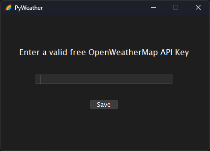
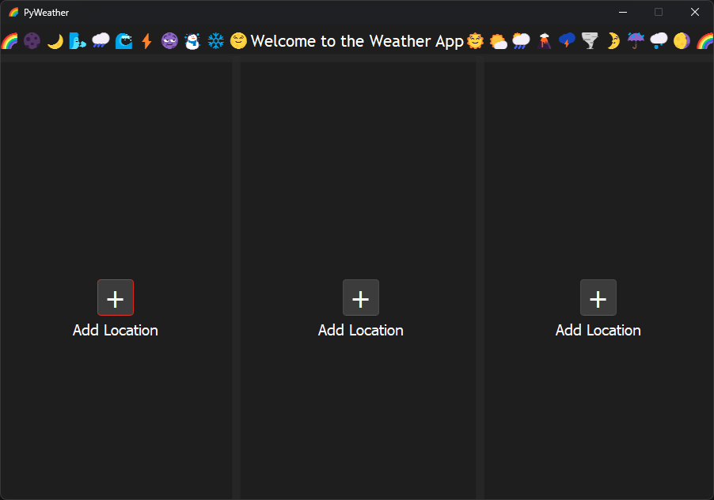
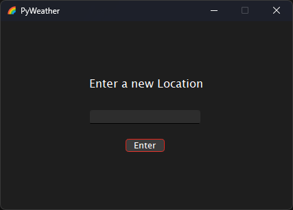
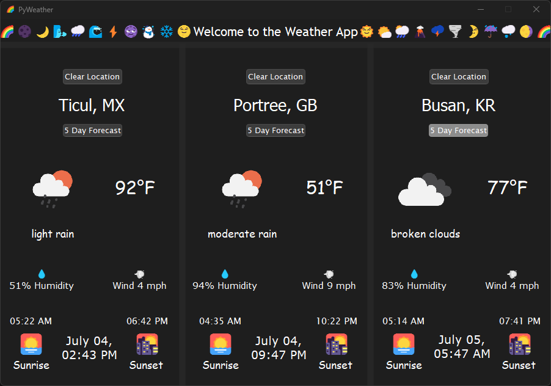
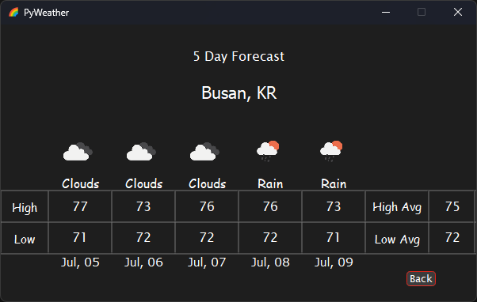

# PyWeather

    - PyWeather is a simple weather application displaying weather data to a GUI built using PyQt6. 
    - It collects and displays current weather data and a 5-day forecast for a specified location using the free OpenWeatherMap API.

## Features

    - Displays current weather conditions including temperature, humidity, wind speed, and visibility.
    - Provides a 5-day weather forecast with high and low temperatures, weather conditions, and icons.
    - Allows users to add and view weather for multiple locations.
    - Graphical user interface designed using PyQt6.

## Requirements

    - Python 3.6+
    - See `requirements.txt` for the full list of dependencies.

## Setup

    1. Create your own OpenWeatherMap.org free API key
    2. **Clone the repository:**
    3. Create a virtual environment and activate.
    4. Install the required packages: pip install -r requirements.txt

## Project Structure
    PyWeather\
    ├── resources\
    │   ├── ui\
    │   │   ├── MainWindow.ui
    │   │   ├── ScreenAddLocation.ui
    │   │   ├── ScreenAddWeatherApi.ui
    │   │   ├── ScreenForecast.ui
    │   ├── icons\
    │   └── ├── app_icon.png
    ├── src\
    │   ├── __init__.py
    │   ├── main.py
    │   ├── Day.py
    │   ├── Forecast.py
    │   ├── ImageLoader.py
    │   ├── Weather.py
    │   └── ConfigManager.py
    ├── tests\
    │   ├── __init__.py
    │   ├── test_weather.py
    │   ├── test_forecast.py
    │   ├── test_day.py

## Screenshots

### API Input

### Blank Menu

### Add Location

### Populated Menu

### 5 Day Forecast

## Usage

    - Start the application:
        When the application starts, it will prompt you to enter your OpenWeatherMap API key. Once entered, the key is saved locally and will not be requested again unless the file is deleted or modified.

    - Add a location:
        Enter the city name in the "Add Location" screen.
        Click the "Enter" button to collect and display the weather data.

    - View the forecast:
        Click on the "Forecast" button to view the 5-day weather forecast.

    - Clear the weather data:
        Click on the "Clear" button to remove the weather data for the specified location.

## License

    - This project is licensed under the MIT License.

## Acknowledgments

    - OpenWeatherMap for providing the weather data API.
